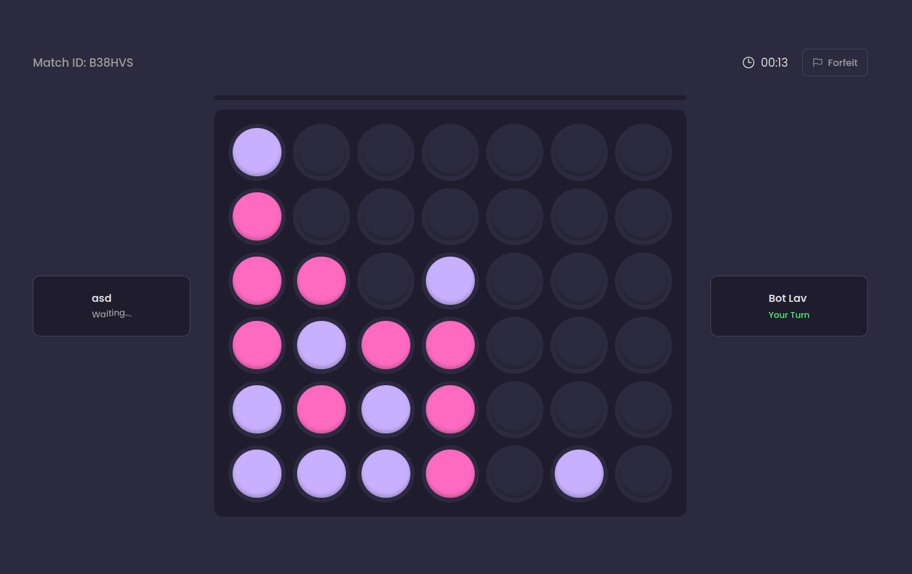

# 🔴🟡  FourPlay Multiplayer Online

Welcome to **FourPlay**, a modern, web-based take on the classic tabletop game! Challenge your friends to a battle of wits in real-time, directly from your browser.

🔗 **Play the game live:** [https://fourplay.up.railway.app/](https://fourplay.up.railway.app/)

## 🎮 What is this App?

This project is a fully playable multiplayer environment for Connect 4. Instead of sitting across from each other at a table, players can instantly spin up a game room and invite opponents from anywhere in the world, or play against an AI!

### Key Features
* **Play vs AI:** Want to practice before playing real people? Challenge the built-in computer opponent!
* **Private Game Rooms:** Want to play with a specific friend? The custom room code system ensures your matches stay private and safe from random joiners.
* **Lightning Fast Real-Time Play:** Every token dropped is instantly mirrored on your opponent's screen without any page-refreshing or lag.
* **Seamless Reconnections:** Accidentally closed the tab? No problem. The game remembers the exact state of the board so you can jump right back in where you left off.
* **Modern Interface:** A clean, responsive design that works beautifully whether you are playing on a laptop or tapping on your phone screen.

## 🎯 How to Play

1. **Create or Join:** One player creates a room and shares the room link/code with a friend, or simply clicks "Play AI" to start a solo match.
2. **Take Turns:** Players (or the computer) take turns dropping their colored tokens into a 7-column, 6-row grid.
3. **Connect Four:** The pieces drop straight down, occupying the lowest available space. The first player to form a horizontal, vertical, or diagonal line of four consecutive tokens wins!

## ⚙️ Under the Hood (Technical Overview)

This app combines a robust real-time multiplayer architecture with an intelligent computer opponent:
* **The AI Algorithm:** The computer opponent uses the legendary **Minimax Algorithm with Alpha-Beta Pruning**. It calculates the best possible moves by "looking ahead" multiple turns into the game tree, ensuring a challenging experience without lagging the server.
* **Multiplayer Rooms:** The room functionality is handled via **Socket.IO Rooms**. When a player creates a match, a unique WebSocket channel is spun up to isolate their traffic, broadcasting moves exclusively to the two players connected to that code.
* **The Engine:** Built on a pure **Node.js** and **Express** backend.
* **The Memory:** **Redis** is used as an ultra-fast caching layer to instantly retrieve the current state of the board in exactly 0 milliseconds, handling player disconnects and immediate reconnections.
* **The Vault:** Completed matches and long-term player statistics are securely tucked away in a **MongoDB** remote database.
